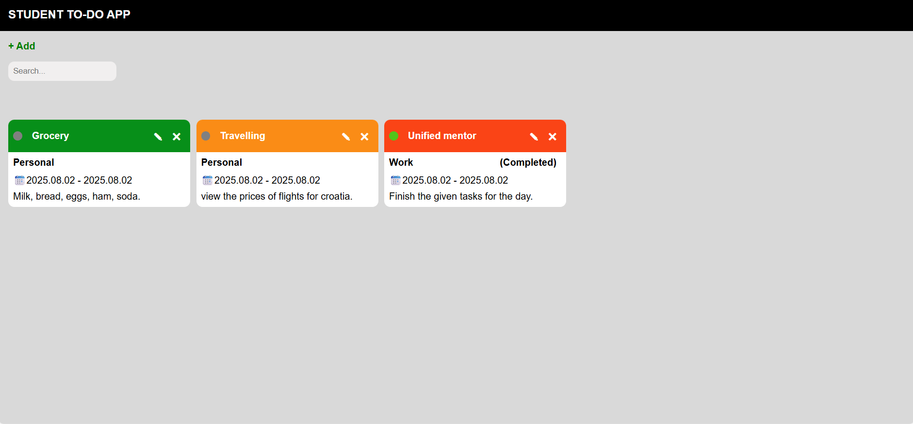
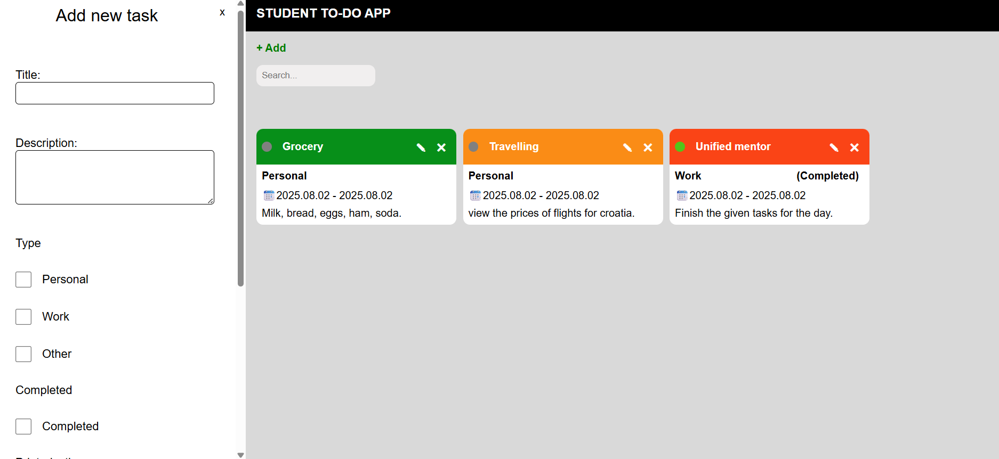

# ToDoListApp

A simple and elegant To-Do List web application built using HTML, CSS, and JavaScript. This app helps users manage daily tasks efficiently with a clean interface and intuitive controls.

# Features

- **Add Tasks**
- **Mark Completed**
- **Delete Tasks**
- **UI Updates**
- **Responsive Design**

# Screenshots




# Tech Stack
- **HTML**
- **CSS**
- **JavaScript**

# Getting Started
To run the app locally:
1. 
```bash
git clone https://github.com/zvoosh/ToDoListApp.git
```
2. Open index.html in your broser

# Author
**Dusan** Feel free to connect or contribute!